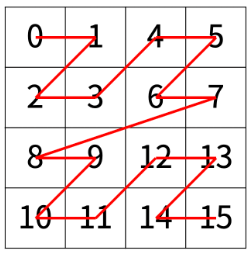

# 1074: Z

[문제 바로가기](https://www.acmicpc.net/problem/1074)

## 문제 설명

- $2^N\times2^N$ 만큼의 배열을 Z모양으로 탐색하려 한다.
- N = 1 일때는 아래처럼 Z자의 순서로 방문한다.



- N > 1 일때는 배열을 $2^{N-1}\times2^{N-1}$ 로 4등분 하고, 각각의 배열을 위처럼 Z자의 순서로 재귀적으로 방문한다.


## 풀이

- 문제에 나와있듯이, 재귀를 이용해 문제를 해결할 수 있다.
- 배열을 4등분 한 후, 알고싶은 `r, c`에 해당하는 부분을 다시 재귀적으로 호출하면 된다.

## 구현

- `void Z(int N, int row, int col, int r, int c, int count)` 의 함수를 만들었다.
    - row, col: 현재 위치한 칸의 행과 열 번호
    - r, c: 문제에서 주어지는 몇번째로 방문하는지 알고싶은 행과 열 번호
    - count: 현재 `[row][col]`번째 칸을 몇번째로 방문하는지에 대한 숫자

- 함수의 맨 처음에서 현재 row와 col이 r과 c와 동일하면 count를 호출하고 종료한다.

```cpp
if(row == r && col == c){
    cout << count << '\n';
    return;
}
```

- stride는 $2^{N-1}$. 즉 배열을 4등분 했을때 간격을 나타내는데, 그 후 조건문과 같이 4개의 구역 중 원하는 `[r][c]`가 어디에 위치해있는지 찾아 N-1을 인자로 해 재귀적으로 함수를 다시 호출한다.

```cpp
int stride = 1 << (N - 1);

if(r < row+stride && c < col+stride){
    Z(N-1, row, col, r, c, count);
    return;
}

count += stride*stride;
```


## 해결한 과정

처음에는 $2^N\times2^N$ 크기의 배열을 만들고 재귀함수를 돌면서 배열에 몇번째로 방문했는지 값을 채운 다음 `[r][c]`번째 칸의 값을 출력했다. 이 방식으로 제출했더니 당연하게도 메모리 초과가 나왔다. $2^{15}=32768$이니 $32768\times32768$을 하면 10억이 넘는데 메모리 제한은 256MB, 즉 int형 변수 64,000,000개가 최대이니 그럴 수 밖에 없었다.

그 다음으로 시도한 방법이 배열을 채우는 과정만 없애고 위와 똑같이 재귀를 돌면서 `[r][c]`에 도달했을 때 출력하고 끝내는 방법이었다. 다만 이 방법은 시간 초과였는데, 사실 첫번째 방법에서 메모리 초과라고 표시되어서 그렇지 메모리 제한이 아니었어도 시간초과가 될 수 밖에 없는 방식이었다. 모든 칸을 탐색하면 10억개 이상의 칸을 방문하는 경우에서 당연히 시간초과가 날 수 밖에 없기 때문이다.

때문에 시간을 줄이는 방법을 생각해 보았는데, 4등분 한 각각의 칸을 모두 탐색하지 않고, 그중 `[r][c]`이 존재하는 하나의 칸만 찾아서 탐색하는 방법을 생각했다. 이를 통하면 `Z` 함수가 호출되는 횟수가 최대 N번이기 때문에 충분하다 생각되어 이 방식으로 제출했고, 통과했다.

## 전체 코드

```cpp
#include <iostream>
#include <vector>
using namespace std;

void Z(int N, int row, int col, int r, int c, int count){

    if(row == r && col == c){
        cout << count << '\n';
        return;
    }

    int stride = 1 << (N - 1);

    if(r < row+stride && c < col+stride){
        Z(N-1, row, col, r, c, count);
        return;
    }
    
    count += stride*stride;

    if(r < row+stride && c < col+2*stride){
        Z(N-1, row, col+stride, r, c, count);
        return;
    }

    count += stride*stride;

    if(r < row+2*stride && c < col+stride){
        Z(N-1, row+stride, col, r, c, count);
        return;
    }
    
    count += stride*stride;

    if(r < row+2*stride && c < col+2*stride){
        Z(N-1, row+stride, col+stride, r, c, count);
        return;
    }
}

int main(){
    int N, r, c;
    cin >> N >> r >> c;

    Z(N, 0, 0, r, c, 0);
    
    return 0;
}

```
