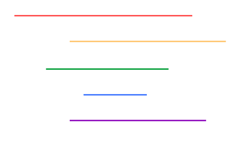
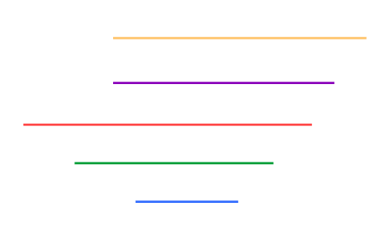

# 2995번: 생일

[문제 바로가기](https://www.acmicpc.net/problem/2995)

## 문제 설명

N개의 구간이 입력으로 들어올 때, 아래 조건을 만족하는 가장 긴 서로 다른 구간의 수열을 찾으려 한다.

- 수열에 포함되는 모든 구간은 다음 위치의 구간을 포함해야 한다.

예를 들면 [1,10], [1,8], [2,7], [4,5] 는 위의 조건을 만족하는 수열이다.

## 풀이

구간의 끝 숫자에 대해 내림차순, 끝 숫자가 같다면 시작 숫자에 대해 오름차순으로 우선 정렬한다.

이렇게 정렬하고 나면 구간을 차례대로 살펴볼 때, 뒤에 나오는 구간(A)의 시작 시간이 앞에 있는 구간(B)보다 크다면 A는 B에 반드시 포함되게 된다.

예를 들어 아래와 같은 구간이 입력으로 주어졌다 하자.



이 구간들을 앞서 말한 조건대로 정렬시키면 아래와 같이 된다.



이때 보라색은 노란색과 시작 지점이 같으므로 노란색 구간에 포함되고, 마찬가지로 파란색은 보라색보다 시작 지점이 뒤에 있으므로 보라색 구간에 포함된다.

따라서 조건을 만족하는 가장 긴 구간의 수열을 구하려면

1. 구간의 끝 숫자에 대해 내림차순, 구간의 시작 숫자에 대해 오름차순으로 정렬한다.
2. 구간을 차례로 살펴보며 시작 지점의 숫자만 가지고 '가장 긴 증가하거나 같은 부분 수열'을 구한다.

즉, lis와 유사한 문제인데 단지 차이는 같은 숫자도 수열에 포함될 수 있다는 것이다.

## 구현

```cpp
bool comp(const Interval a, const Interval b){
    if(a.end == b.end) return a.start < b.start;
    return b.end < a.end;
}
```
- 구간들의 정렬에 사용할 비교함수

```cpp
vector<int> minLast(N+2, INF);

int len = 0;
for(int i = 1; i <= N; i++){
    int index = upper_bound(minLast.begin()+1, minLast.end(), intervals[i].start) - minLast.begin();

    location[i] = index;
    minLast[index] = intervals[i].start;
    len = max(len, index);
}
```
- lis를 구하는 과정
- index를 구할 때 lower_bound가 아닌 upper_bound를 사용해 같은 숫자여도 수열을 이어나간다.
- 이때 lower_bound를 사용하면 다음과 같은 상황이 반례로 작동하게 된다.

```
[input]
7
1 7
2 7
3 7
3 7
5 7
3 6
4 6

[answer]
6
1 7
2 9
3 7
3 7
3 6
4 6
```
- lower_bound를 사용해 구현하면 해당 예제를 돌렸을때 수열의 길이가 6보다 작게 나올 수 있다.

사실 이 글에서 말한 정렬 방법 말고, 시작 숫자에 대해 내림차순 -> 끝 숫자에 대해 오름차순 의 순서로 정렬 후, 구간들의 끝 숫자를 보며 lis(같은것 포함)를 구하는 방법도 가능하다.

## 전체 코드

```cpp
#include <iostream>
#include <vector>
#include <algorithm>
using namespace std;

#define INF 987654321

struct Interval {
    int start;
    int end;
};

bool comp(const Interval a, const Interval b){
    if(a.end == b.end) return a.start < b.start;
    return b.end < a.end;
}

int main(){
    cin.tie(0)->ios::sync_with_stdio(false);

    int N;
    cin >> N;

    vector<Interval> intervals(N+1);
    for(int i = 1; i <= N; i++){
        cin >> intervals[i].start >> intervals[i].end;
    }
    sort(intervals.begin()+1, intervals.end(), comp);

    vector<int> minLast(N+2, INF);
    vector<int> location(N+1);

    int len = 0;
    for(int i = 1; i <= N; i++){
        int index = upper_bound(minLast.begin()+1, minLast.end(), intervals[i].start) - minLast.begin();

        location[i] = index;
        minLast[index] = intervals[i].start;
        len = max(len, index);
    }

    cout << len << '\n';

    vector<Interval> answer;

    for(int i = intervals.size()-1; i >= 1; i--){
        if(location[i] == len){
            answer.push_back(intervals[i]);
            len--;
        }
    }

    for(auto iter = answer.rbegin(); iter != answer.rend(); iter++){
        cout << iter->start << ' ' << iter->end << '\n';
    }

    return 0;
}
```