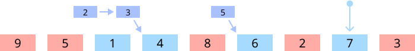
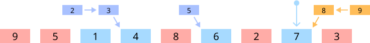

# 3045번: 이중 연결 리스트

[문제 바로가기](https://www.acmicpc.net/problem/)

## 문제 설명

이중 연결 리스트에서 수행할 수 있는 연산이 다음과 같이 두가지 있다.

- A X Y: 노드 X를 노드 Y 앞으로 이동
- B X Y: 노드 X를 노드 Y 뒤로 이동

노드의 수 N과 연산들이 주어질 때, 연산을 모두 수행한 후, 리스트를 처음 상태로 되돌리는데 필요한 연산의 최솟값과 이때의 연산들을 구하는 문제이다.

이때 노드 번호는 1번부터 N번까지 존재한다.

## 풀이

우선 이중 연결 리스트를 만들고, A와 B 연산을 구현한다. 이를 이용해 구한 최종 리스트의 상태에서 lis를 구하자.

이때 [1365번: 꼬인 전깃줄](https://www.acmicpc.net/problem/1365)과 비슷하게, 원래 상태로 되돌리기 위해 필요한 연산 수의 최소는 lis에 포함되지 않는 노드의 개수와 같다.

그렇다면 이때 어떤 연산들이 필요한 지는 어떻게 구할까?


- 만약 위와 같이 리스트가 만들어졌다고 하자. 파란색은 lis에 포함되는 노드, 빨간색은 그렇지 않은 노드를 의미한다
.



- lis에서 가장 큰 수인 7에서 1씩 감소시키며 lis에 포함되지 않은 수 `n`을 `n+1`의 앞으로 옮긴다. 
    - `A n n+1`



- 그리고 7에서 1씩 증가시키며 lis에 포함되지 않은 수 `n`을 `n-1`의 뒤로 옮긴다.
    - `B n n-1`

이러한 연산들을 거치면 처음 리스트의 상태로 돌아갈 수 있다.

## 구현

Todo

## 전체 코드

```cpp
#include <iostream>
#include <vector>
#include <list>
#include <algorithm>
using namespace std;

#define INF 987654321

struct Node {
    int num;
    struct Node* prev;
    struct Node* next;
};

int main(){
    ios::sync_with_stdio(false);
    cin.tie(0);     cout.tie(0);

    int N, M;
    cin >> N >> M;

    Node **node = new Node*[N+2];
    for(int i = 0; i <= N+1; i++){
        node[i] = new Node;
    }
    
    Node* &head = node[0];
    Node* &tail = node[N+1];

    for(int i = 1; i <= N; i++){
        node[i]->num = i;
        node[i]->prev = node[i-1];
        node[i]->next = node[i+1];
    }
    head->next = node[1];
    tail->prev = node[N];

    int X, Y;
    char cmd;
    for(int i = 0; i < M; i++){
        cin >> cmd >> X >> Y;
        
        node[X]->prev->next = node[X]->next;
        node[X]->next->prev = node[X]->prev;

        if(cmd == 'A'){
            node[X]->prev = node[Y]->prev;
            node[X]->next = node[Y];

            node[Y]->prev->next = node[X];
            node[Y]->prev = node[X];
        } else{
            node[X]->prev = node[Y];
            node[X]->next = node[Y]->next;

            node[Y]->next->prev = node[X];
            node[Y]->next = node[X];
        }
    }

    vector<int> arr;
    vector<int> minLast(N, INF);
    vector<int> location;

    int lisLength = 0;

    Node *cur = node[0];
    int i = 0;
    while((cur = cur->next) != node[N+1]){
        arr.push_back(cur->num);
        i++;

        int index = lower_bound(minLast.begin(), minLast.end(), cur->num) - minLast.begin();

        minLast[index] = cur->num;
        location.push_back(index+1);

        lisLength = max(lisLength, index+1);
    }

    vector<int> lis(lisLength+1);
    lis[0] = 0;

    int len = lisLength;
    for(int i = location.size()-1; i >= 0; i--){
        if(location[i] == len){
            lis[len--] = arr[i];
        }
    }

    cout << N - lisLength << '\n';
    int now;
    for(int i = lisLength; i >= 1; i--){
        now = lis[i]-1;

        while(now > lis[i-1]){
            cout << "A " << now << " " << now+1 << "\n";
            now--;
        }
    }

    for(int now = lis.back()+1; now <= N; now++){
        cout << "B " << now << " " << now-1 << "\n";
    }

    for(int i = 0; i <= N+1; i++){
        delete node[i];
    }
    delete node;
    
    return 0;
}
```