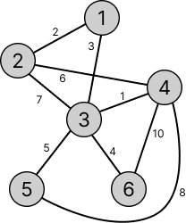
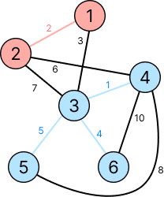
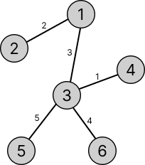
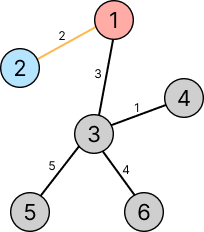
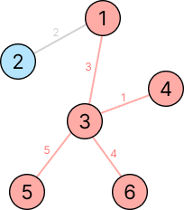
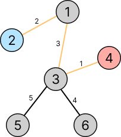
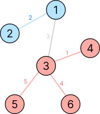

# 23034번: 조별과제 멈춰!

[문제 바로가기](https://www.acmicpc.net/problem/23034)

## 문제 설명

교수님이 시험기간에 조별과제를 내셔서 조교가 조를 나눈다는 내용이다... 문제 내용은 다음과 같다.

-   N명의 학생을 각각 1명 이상이 포함된 두개의 조로 나눈다.
-   각 조의 팀장에게 공지를 할 때, 팀장에서부터 회선으로 퍼져나가 모든 학생이 공지를 들을 때 까지 소요되는 비용의 최솟값을 구하려 한다.
-   이때 여러개의 질문을 하는데, 질문 `X Y`는 X와 Y가 팀장일 때 비용의 최솟값을 묻는 질문이다.

## 풀이



우선 문제의 입력이 위와 같이 주어진다고 하자. 이때 조장이 1번과 3번 학생이 조장이라고 한다면 



아래와 같이 나눠질 때 비용이 최소가 된다. 

이때 알 수 있는 점은 사용되는 간선은 MST에 포함된 간선들이라는 것이다. 따라서 처음에 입력받고 우선 MST를 구해준다.



그 다음, 비용이 최소가 되려면 MST에서 어떤 간선들을 사용해야 하는지 생각해 보자.

우선 1번과 2번이 조장일 때를 살펴보자.



이때 당연하게도 1번과 2번이 분리되어야 하기 때문에 1번과 2번을 연결하는 MST의 간선을 제외하고 나머지 간선들을 사용하게 된다.



다음으로 2번과 4번이 조장일 때를 보자.



이때도 위에서처럼 조장 두명이 분리되어야 하는데, 그러려면 두 조장을 연결하는 simple path에 있는 간선중 하나를 제외해야 한다. 그러면서 간선들의 비용의 합은 최소가 되야 하기 때문에 두 조장을 연결하는 simple path에서 가중치가 가장 큰 간선 하나를 제외하면 된다.


위의 예에서 2번과 4번을 잇는 경로중, 가중치가 가장 큰 '3'의 간선을 제외하고 나머지를 선택하면 된다.



즉 'MST를 이루는 간선들의 가중치의 합' 에서 '두 조장을 잇는 simple path중 가장 큰 가중치'를 빼면 된다.

## 구현

MST를 구하는 것은 간단한데, 그러면 두 조장 사이의 가장 큰 가중치는 어떻게 구해야 할까?

```cpp
int mst = 0;
int connected = N-1;
while(connected){
    auto cur = pq.top();
    pq.pop();

    if(Find(cur.u) == Find(cur.v)) continue;
    
    connected--;

    Union(cur.u, cur.v);
    mst += cur.cost;
    adj[cur.u].push_back(make_pair(cur.v, cur.cost));
    adj[cur.v].push_back(make_pair(cur.u, cur.cost));
}
```

- 우선 MST를 구하고, MST를 구하는 과정에서 사용된 간선들을 인접 리스트 adj에 저장했다.

```cpp
int biggestCost[1001][1001] = { 0,};

for(int i = 1; i <= N; i++){
    bool visited[1001] = { false,};
    visited[i] = true;

    queue<int> q;
    q.push(i);

    while(!q.empty()){
        int cur = q.front();
        q.pop();

        for(auto next: adj[cur]){
            if(visited[next.first]) continue; // for bfs
            visited[next.first] = true;
            q.push(next.first);

            biggestCost[i][next.first] = max(next.second, biggestCost[i][cur]);
        }
    }
}
```

- 그다음 biggestCost를 정의했는데 `biggestCost[i][j]`는 i에서 j로 가는 경로에서 가장 큰 가중치를 저장한다.
- 바깥쪽 for문에서 i는 biggestCost를 구할 때 `[i]`를 의미한다.
- while문에서 BFS를 진행하며 가장 큰 가중치를 `max(next.second, biggestCost[i][cur])`로 지정한다.
    - `next.second`는 새로 탐색하는 간선이고 `biggestCost[i][cur]`는 탐색을 시작한 노드 i에서 next로 가기 직전까지 경로에서 가장 큰 가중치를 나타낸다.

```cpp
for(int i = 0; i < Q; i++){
    cin >> X >> Y;
    cout << mst - biggestCost[X][Y] << '\n';
}
```

- 그 다음은 단순하게 MST의 가중치의 합에서 `biggestCost[X][Y]`를 빼준 값을 출력하면 된다.

## 해결한 과정

처음에는 각각의 질문에 대해서 최소 비용을 구했다. 이때 union 함수를 다음과 같이 작성했다.

```cpp
bool Union(int a, int b, int X, int Y){
    a = Find(a);
    b = Find(b);

    if(a != b){
        if(a == X || a == Y){
            if(b == X || b == Y){
                return false;
            } else{
                par[b] = a;
                return true;
            }
        } else{
            par[a] = b;
            return true;
        }
    }
    return false;
}
```

```cpp
if(Union(cur.u, cur.v, X, Y)) result += cur.cost;
```

- a와 b의 조상이 둘다 X or Y 이면 둘이 연결할 필요가 없으므로 false를 반환해 이 결과값에 해당 cost를 더하지 않는다.

위 방식으로 X와 Y가 연결되지 않으면서 다른 노드들은 연결하는 방식으로 정답을 구했었다. 다만 이는 모든 질문 각각에 대해 답을 구하고 있다 보니 시간 초과를 받았다.

그래서 그 다음으로 본문에서 설명한 방식으로 답을 구하려 했다. 그런데 이때 

```cpp
int maxCost = 0;

while(!q.empty()){
    int cur = q.front();
    q.pop();

    for(auto next: adj[cur]){
        if(visited[next.first]) continue; // for bfs
        visited[next.first] = true;
        q.push(next.first);

        maxCost = max(maxCost, next.second); // get max cost
        biggestCost[i][next.first] = maxCost;
    }
}
```

이렇게 작성했는데, 경로에 포함되지 않는 간선의 가중치에도 영향을 받을 수 있어 올바르지 않은 풀이었다.

그래서 정답 코드처럼 써서 제출했는데 이때 3번이나 시간 초과를 받고 대체 왜지.. 하다가 biggestCost와 adj를 vector에서 배열로 고쳤더니 아주 빠르게 통과되면서 '성공'을 띄웠다..

